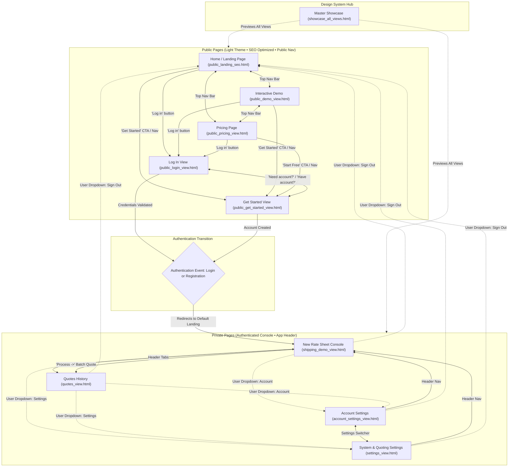

# Ratesift Page Architecture & Relation Flowchart

This document provides a comprehensive structural map of the **Ratesift** platform, organizing all 9 views into **Public Pages** and **Private (Authenticated) Pages**, with full transition logic and relationship mappings.

---

## 1. High-Level Architecture Flowchart

---

## 2. Page Classification & Relations Breakdown

### A. Public Pages (Accessible to All Users & Crawlers)

All public pages share a unified header (SF Logo, Home/Demo/Pricing menu, Log in, Get Started) and footer (SF Logo, Docs, Support, API, Privacy, Date):

| Page | File | Purpose | Primary Outbound Relations |
| :--- | :--- | :--- | :--- |
| **Home / Landing** | [public_landing_seo.html](file:///C:/Users/Dylan/.gemini/antigravity/brain/b5a860ed-1691-4f5a-8f2d-ad2b4e7701e4/public_landing_seo.html) | Brand introduction, SEO indexing, key value propositions, quoting engine workflow. | • `Demo` • `Pricing` • `Log in` • `Get Started` |
| **Demo** | [public_demo_view.html](file:///C:/Users/Dylan/.gemini/antigravity/brain/b5a860ed-1691-4f5a-8f2d-ad2b4e7701e4/public_demo_view.html) | Live interactive preview with sample rate sheets (Parcels, Pallets, Medical) without signing up. | • `Home` • `Pricing` • `Log in` • `Get Started (CTA)` |
| **Pricing** | [public_pricing_view.html](file:///C:/Users/Dylan/.gemini/antigravity/brain/b5a860ed-1691-4f5a-8f2d-ad2b4e7701e4/public_pricing_view.html) | 4 tiers: Free Starter ($0), Broker Pro ($49), Broker Team ($149), Business (Custom). Monthly/Annual toggle. | • `Home` • `Demo` • `Get Started (Free Tier)` • `Log in` |
| **Log In** | [public_login_view.html](file:///C:/Users/Dylan/.gemini/antigravity/brain/b5a860ed-1691-4f5a-8f2d-ad2b4e7701e4/public_login_view.html) | Single centered credential entry with 1-click `Auto-fill Alex Rivers`. | • `Get Started (Switch)` • Redirects to `New Rate Sheet` upon login |
| **Get Started** | [public_get_started_view.html](file:///C:/Users/Dylan/.gemini/antigravity/brain/b5a860ed-1691-4f5a-8f2d-ad2b4e7701e4/public_get_started_view.html) | Dedicated single centered account creation box with origin ZIP and 1-click test setup. | • `Log in (Switch)` • Redirects to `New Rate Sheet` upon account creation |

---

### B. Private Pages (Authenticated User Console)

Private pages use the authenticated console header with **SF Logo**, **New Quote**, **History**, and the **User Dropdown (`Alex R. ˅`)**:

| Page | File | Purpose | Primary Outbound Relations |
| :--- | :--- | :--- | :--- |
| **New Rate Sheet** | [shipping_demo_view.html](file:///C:/Users/Dylan/.gemini/antigravity/brain/b5a860ed-1691-4f5a-8f2d-ad2b4e7701e4/shipping_demo_view.html) | Core application engine: upload `.xlsx`/`.xls`, preview parsed columns, click `Process →`. | • `Quotes History` • Dropdown: `Account` • Dropdown: `Settings` • Dropdown: `Sign out` |
| **Quotes History** | [quotes_view.html](file:///C:/Users/Dylan/.gemini/antigravity/brain/b5a860ed-1691-4f5a-8f2d-ad2b4e7701e4/quotes_view.html) | Data warehouse of generated quotes, search by Quote ID, sort by rates, Excel cell tracking. | • `New Rate Sheet` • Dropdown: `Account` • Dropdown: `Settings` • Dropdown: `Sign out` |
| **Account Settings** | [account_settings_view.html](file:///C:/Users/Dylan/.gemini/antigravity/brain/b5a860ed-1691-4f5a-8f2d-ad2b4e7701e4/account_settings_view.html) | Profile management for Alex Rivers, TechCorp Logistics, default origin ZIP `94103`. | • `System Settings` • `New Rate Sheet` • `Quotes History` • `Sign out` |
| **System Settings** | [settings_view.html](file:///C:/Users/Dylan/.gemini/antigravity/brain/b5a860ed-1691-4f5a-8f2d-ad2b4e7701e4/settings_view.html) | Quote engine rules (USD, lbs, +10% markup, auto-header detection, empty row skipper). | • `Account Settings` • `New Rate Sheet` • `Quotes History` • `Sign out` |

---

### C. Design Showcase & Review Hub

* **[showcase_all_views.html](file:///C:/Users/Dylan/.gemini/antigravity/brain/b5a860ed-1691-4f5a-8f2d-ad2b4e7701e4/showcase_all_views.html)**:
  * Unified side-by-side presentation tool featuring **2x2 Grid View**, **Horizontal Strip**, and **Live Interactive Tabs (1 through 9)**.
  * Links directly into every public and private screen for review.
